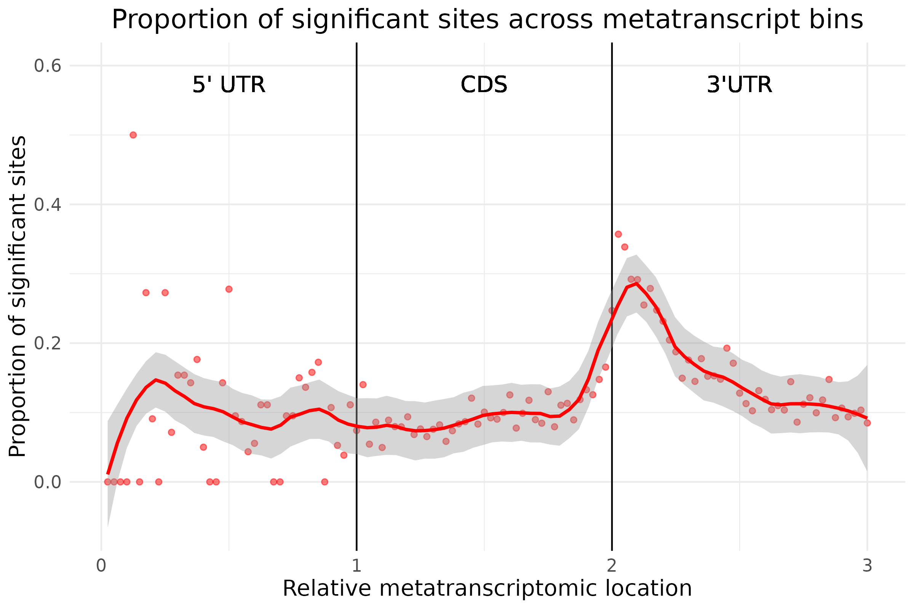
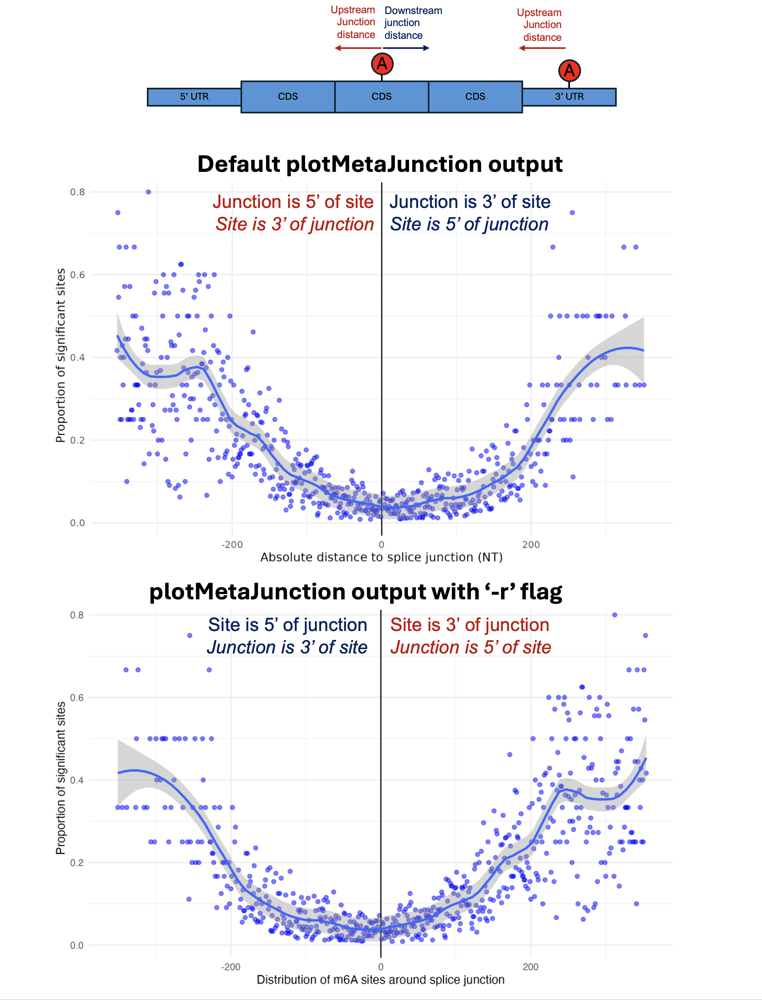

# R2Dtool

R2Dtool is a set of genomics utilities for handling, integrating, and viualising isoform-mapped RNA feature data.

  - **Integrate** transcriptome-mapped data: R2Dtool performs liftover of transcriptome-mapped RNA features to their corresponding genomic coordinates

  - **Annotate** transcriptome-mapped sites: R2Dtool annotates transcript-specific metatranscript coordinates and absolute and relative distances to annotated transcript landmarks, in an isoform-specific manner.

  - **Visualise** isoform-aware RNA feature distributions: R2Dtool introduces isoform-aware **metatranscript** plots and **metajunction** plots to study the positonal distribution of RNA features around annotated RNA landmarks.


> [R2Dtool is published in *Bioinformatics*](https://academic.oup.com/bioinformatics/article/40/8/btae495/7729116)    
> Sethi, A. J., Mateos, P. A., Hayashi, R., Shirokikh, N. & Eyras, E. R2Dtool: integration and visualization of isoform-resolved RNA features. *Bioinformatics*, Volume 40, Issue 8 (2024)    
> doi: 10.1093/bioinformatics/btae495

# Contents 

   - [Quick-start guide](#quick-start-guide)
       - [System requirements](#system-requirements)
       - [Compiling R2Dtool from source](#compiling-r2dtool-from-source)
       - [R2Dtool tutorial](#r2dtool-tutorial)
   - [R2Dtool file formats](#r2dtool-file-formats)
       - [Input and output data structure](#input-and-output-data-structure)
       - [Gene annotation requirements](#gene-annotation-requirements)
   - [R2Dtool commands](#r2dtool-commands)
       - [Handling isoform-mapped RNA sites](#handling-isoform-mapped-rna-sites)
       - [Visualising isoform-aware RNA feature metadistributions](#visualising-isoform-aware-rna-feature-metadistributions)


# Quick-start guide 

#### System requirements

R2Dtool has been tested on OS X 14.1, Red Hat Enterprise Linux 4.18.0, and should be broadly compatible with any system that support Rustc and R. We recommend using R2Dtool in an environment with at least 4 CPU cores and 12GB of free memory.

- R2Dtool requires ```rustc``` and ```cargo``` for compilation. 
- Additionally, ```R```, along with ```tidyverse``` and ```binom``` R packages, are requred to generate metaplots. 


#### Compiling R2Dtool from source: 

```
# clone R2Dtool and compile using Cargo 
git clone https://github.com/comprna/R2Dtool.git && cd R2Dtool
cargo build --release

# add R2Dtool to PATH
export PATH="$PATH:$(pwd)/target/release/"
```

#### R2Dtool tutorial

We provide a short tutorial that allows you to test R2Dtool. We provide a toy dataset of isoform-mapped m6A predictions in HeLa cells, taken from [Figure 1E and 1F of the manuscript.](https://doi.org/10.1101/2022.09.23.509222) 

##### Input data

The input dataset, ```./test/m6A_isoform_sites_GRCh38_subset.bed```, contains the positions and stoichiometry of m6A sites mapped to GRCh38 transcript isoforms, in a tab-separated ```BED3+``` format. R2Dtool can [operate on any transcriptome-mapped RNA sites](#input-and-output-data-structure), where transcript ID and transcript coordinates are specified columns 1-3:
```
$ head -n 3 ./test/m6A_isoform_sites_GRCh38_subset.bed 
transcript         start  end   base  coverage  strand  N_valid_cov  fraction_modified
ENST00000381989.4  2682   2683  a     10        +       10           0.00
ENST00000381989.4  2744   2745  a     10        +       10           0.00
```

To liftover positions from RNA to DNA coordinates, R2Dtool requires a GTF2.2 annotation, provided at ```./test/GRCh38.110_subset.gtf```: 
```
$ head -n 2 ./test/GRCh38.110_subset.gtf
12      ensembl_havana  transcript      4487735 4538469 .       -       .       gene_id "ENSG00000047621"; gene_version "12"; transcript_id "ENST00000261250"; transcript_version "8"; gene_name "C12orf4"; gene_source "ensembl_havana"; gene_biotype "protein_coding"; transcript_name "C12orf4-201"; transcript_source "ensembl_havana"; transcript_biotype "protein_coding"; tag "CCDS"; ccds_id "CCDS8528"; tag "basic"; tag "Ensembl_canonical"; tag "MANE_Select"; transcript_support_level "1 (assigned to previous version 7)";
12      ensembl_havana  exon    4538409 4538469 .       -       .       gene_id "ENSG00000047621"; gene_version "12"; transcript_id "ENST00000261250"; transcript_version "8"; exon_number "1"; gene_name "C12orf4"; gene_source "ensembl_havana"; gene_biotype "protein_coding"; transcript_name "C12orf4-201"; transcript_source "ensembl_havana"; transcript_biotype "protein_coding"; tag "CCDS"; ccds_id "CCDS8528"; exon_id "ENSE00001378522"; exon_version "2"; tag "basic"; tag "Ensembl_canonical"; tag "MANE_Select"; transcript_support_level "1 (assigned to previous version 7)";
```
More detail on R2Dtool GTF annotation requirements is [provided on the R2Dtool Wiki](https://github.com/comprna/R2Dtool/wiki/R2Dtool-GTF-requirements). 


##### R2Dtool liftover 

To fetch the genomic coordinates for each transcriptome-mapped modification site, we can use R2Dtool ```liftover```:

```
# liftover transcriptomic sites to genomic coordinates
$ r2d liftover -H -g ./test/GRCh38.110_subset.gtf -i ./test/m6A_isoform_sites_GRCh38_subset.bed > ./test/liftover.bed

$ head -n 3 ./test/liftover.bed 
chromosome  start     end       name  score  strand  transcript         start  end   base  coverage  strand  N_valid_cov  fraction_modified
13          24455165  24455166               -       ENST00000381989.4  2682   2683  a     10        +       10           0.00
13          24435272  24435273               -       ENST00000381989.4  3941   3942  a     20        +       20           80.00
```
The genomic coordinates for each site are prepended to columns 1-6 of the output in standard BED6 format. We can now explore the genomic context of m6A sites by opening ```liftover.bed``` in the genome browser, or compare the positions of our m6A sites to features previously annotated in genomic coordinates using [bedtools](https://bedtools.readthedocs.io/en/latest/). Liftover calculations and ouputs are described in further detail on the [R2Dtool Wiki](https://github.com/comprna/R2Dtool/wiki/Further-information-on-r2d-liftover). 

##### R2Dtool annotate 

We can use R2Dtool ```annotate``` to annotate RNA features with metatranscript coordinates and distances to local transcript features:

```
# annotate transcriptomic-mapped m6A sites 
$ r2d annotate -H -g ./test/GRCh38.110_subset.gtf -i ./test/m6A_isoform_sites_GRCh38_subset.bed > ./test/annotate.bed

$ head -n 3  ./test/annotate.bed 
transcript         start  end   base  coverage  strand  N_valid_cov  fraction_modified  gene_id          gene_name  transcript_biotype  tx_len  cds_start  cds_end  tx_end  transcript_metacoordinate  abs_cds_start  abs_cds_end  up_junc_dist  down_junc_dist
ENST00000381989.4  2682   2683  a     10        +       10           0.00               ENSG00000102699  PARP4      protein_coding      5437    74         5246     5437    1.50425                    2608           -2564        46            150
ENST00000381989.4  2744   2745  a     10        +       10           0.00               ENSG00000102699  PARP4      protein_coding      5437    74         5246     5437    1.51624                    2670           -2502        108           88

```

The input sites are appended with 12 additional columns of isoform-specific annotation data, including isoform-specific metatranscript coordinates, and distances to transcript landmarks. ```Annotate``` calculations and outputs are described in further detail on the [R2Dtool Wiki](https://github.com/comprna/R2Dtool/wiki/Further-information-on-r2d-annotate). 

##### R2Dtool metafeature plots  

R2Dtool contains several plotting functions which display the distribution of RNA features across transcripts and around transcript landmarks. All of these functions operate on ```R2Dtool annotate -H``` output.


To visualise the distribution of RNA features across the length of transcripts, we can make isoform-resolved metatranscript plots. Here, we will show the proportion of methylated sites (sites with >10% m6A methylation) across a normalised metatranscript model: 

```
# make metatranscript plot using annotated sites 
$ r2d plotMetaTranscript -i "./test/annotate.bed" -o "./test/metatranscript_m6A.png" -f "fraction_modified" -u "10" -t "upper" -l 
```

The plot shows the proportion of sites that have greater than 10% m6A methylation in each metatranscript bin: 


We can also study the distribution of m6A sites around exon-exon junctions in an isoform specific manner, using the plotMetaJunction function: 

```
# make metajunction plot using annotated sites 
$ r2d plotMetaJunction -i "./test/annotate.bed" -o "./test/metajunction_m6A.png" -f "fraction_modified" -u "10" -t "upper" 
```

The plot shows the proportion of sites that have greater than 10% m6A methylation, with their distances to local splice-junctions: 


More information about R2Dtool plots is available on the [R2Dtool Wiki](https://github.com/comprna/R2Dtool/wiki/Visualising-RNA-feature-distributions-with-R2Dtool.


# R2Dtool file formats 


#### Input BED file columns

R2Dtool can parse RNA feature positions in transcriptome coordinates, provided in tab-delimited BED3+ file. At minimum, the RNA feature sites must contain the following fields: 

* Column 1 must contain transcript ID.
* Column 2 and 3 must represent the coordinates of the RNA feature in zero-based, half-open coordinates.

Any number of additional metadata columns (e.g. feature labels, stoichiometry, probability, motifs, etc. ) can be provided in columns 4 onwards. These fields will be lossless preserved in the ```liftover``` and ```annotate``` outputs. 

##### Input & output header rows 

* R2Dtool can flexibly operate on input BED files with or without column names. 
* By default, R2Dtool assumes that column names are not present.
* If a header row is present in the input BED file, the ```-H``` flag must be passed to ```liftover``` and ```annotate```.
* When the ```-H``` flag is used, R2Dtool will preserve the input header, and populate the the column names for new columns. 
* R2Dtool will only produce output headers when input headers are provided and the ```-H``` flag is specified. 

We highly recommend using headers on input files where possible. ```annotate``` must be used with the header flag ```-H``` for compatiblity with R2Dtool metaplots. 

#### Strand and coordinate handling

* For the purpose of ```liftover``` and ```annotation```, feature strand is always assumed as being positive.
* For the purpose of annotation, the ```start``` coordinate of the feature is used to annotate the RNA feature and assign a metatranscript coordinate.


#### Gene annotation requirements 

R2Dtool is designed to work with [GTF version 2.2 annotations](http://mblab.wustl.edu/GTF22.html). We provide detailed information on R2Dtool GTF file requirements on the [R2Dtool Wiki](https://github.com/comprna/R2Dtool/wiki/R2Dtool-GTF-requirements). In short: 

The provided GTF file must contain the following ``feature types``: 
- 'transcript' or 'mRNA' 
- 'exon', 
- 'CDS', 
- 'five_prime_utr' or '5UTR' 
- 'three_prime_utr' or '3UTR'

The ```transcript``` feature types must contain the following ``feature attributes``: 
-  'transcript_id'
-  'gene_id'
-  'gene_name'
-  'transcript_biotype' or 'transcript_type' or 'gene_type' or 'gene_biotype')

The ```transcript_id``` in the input BED file must exactly match the ```transcript_id``` feature type in the GTF file. In case ```transcript_version``` is present in only one of these fields, the ```-t``` flag can be passed to R2Dtool. See the [GTF page of the R2Dtool Wiki](https://github.com/comprna/R2Dtool/wiki/R2Dtool-GTF-requirements) for more information. 

We recommend the use of Ensembl annotations, which don't contain pseudoautosomal (PAR) regions. R2Dtool skips PAR regions when parsing GTF files. 


# R2Dtool commands

#### Handling isoform-mapped RNA sites 

**Liftover** transcriptome-mapped features to genomic coordinates:

```
Usage: r2d liftover -i <input> -g <gtf>

Arguments:
    -i, --input <input>: Path to tab-separated transcriptome sites in BED format. 
    -g, --gtf <annotation>: Path to gene structure annotation in GTF format.

Options:
    -H, --header: Indicates the input file has a header, which will be preserved in the output [Default: False]
    -o, --output <OUTPUT>: Path to output file [Default: STDOUT]
    -t, --transscript-version: Indicates that '.'-delimited transcript version information is present in col1 and should be considered during liftover [default: False].
```
- Liftover prepends 6 columns to the input file, containing the genome coordinates of the transcript features in BED format
- All data in the original input are preserved in the output and shifted by 6 columns 

[More information on ```r2d liftover``` can be found on the R2Dtool wiki](https://github.com/comprna/R2Dtool/wiki/Further-information-on-r2d-liftover)

**Annotate** transcriptome-mapped sites with isoform-specific distances to transcript landmarks:

```
Usage: r2d annotate -i <input> -g <gtf>

Arguments:
    -i, --input <input>: Path to tab-separated transcriptome sites in BED format. 
    -g, --gtf <annotation>: Path to gene structure annotation in GTF format.

Options:
    -H, --header: Indicates the input file has a header, which will be preserved in the output [Default: False]
    -o, --output <OUTPUT>: Path to output file [Default: STDOUT]
    -t, --transcript-version: Indicates that '.'-delimited transcript version is present in col1 and should be considered during annotation [default: False].

```

Annotation adds the following information to the epitranscriptomic sites as additional coluumns, relying on the gene structure GTF to generate these data.

```
gene_id | gene_name | transcript_biotype  | tx_len | cds_start | cds_end | transcript_metacoordinate | abs_cds_start | abs_cds_end | up_junc_dist | down_junc_dist
```

- ```cds_start``` and ```cds_end``` represent the positions of the coding sequence start and end compared to the transcript.
- ```transcript_metacoordinate``` represents the scaled metatrascript position of the given RNA feature, between 0 and 3, where 0 represents transcript start-site, 1 represents CDS start, 2 represent CDS end, and 3 represents the 3' transcript end. 
- ```abs_cds_start``` and ```abs_cds_end``` represent the absolute distance (in nt) of a given feature from the cds start and end
- ```up_junc_dist``` and ```down_junc_dist``` repreesnt the absolute distance (in nt) of a given site from the nearest upstream and downstream splice-junction contained in a given transcript

> [!NOTE]
> - ```annotate``` can be perfomed before, but __not__ after, ```liftover```
> - ```annotate``` requires protein-coding gene models in order to calculate feature metacoordinates and distances to CDS starts and ends 

[More information on ```r2d annotate``` can be found on the R2Dtool wiki](https://github.com/comprna/R2Dtool/wiki/Further-information-on-r2d-annotate)

#### Visualising isoform-aware RNA feature metadistributions

**Plot** the **metatranscript** distribution of RNA features:

```

r2d plotMetaTranscript --input <annotated bed file> --output <plot save path> --filter-field <STRING> --cutoff <INT> --cutoff-type <"upper"/"lower">

Arguments:
	--input <INPUT>: Path to R2Dtool annotated bed file, with headers 
    --output <OUTPUT>: Path to save plot, with .svg or .png extension [Default: STDOUT]
    --filter-field <STRING>: Column-name for column which can be used to select significant sites (e.g., feature stoichiometry or detection p-value) 
    --cutoff <INT>: Value in filter field which identifies significant sites 
    --cutoff-type <STRING>: Whether to use values lower than cutoff ("lower") or higher than cutoff ("higher") to select significant sites 

Optional arguments: 

- The flag "-c [method]" can be used to change the strategy used for displaying confidence intervals between loess (default) or binoial confidence intervals (-c "binom")
- The flag "-o [/path/to/table.tsv]" can be used to save the aggregated metatranscript data as a tab-separated file 
- The flag "-l" displays transcript region labels (5' UTR, CDS, 3'UTR) on the plot (default = FALSE)
```


**Plot** the **metacodon** distribution of RNA features:

```
r2d plotMetaCodon --input <annotated bed file> --output <plot save path> --filter-field <STRING> --cutoff <INT> --cutoff-type <"upper"/"lower"> <--start/--stop>

Arguments: 

--input <INPUT>: Path to R2Dtool annotated bed file, with headers 
--output <OUTPUT>: Path to save plot, with .svg or .png extension [Default: STDOUT]
--filter-field <STRING>: Column-name for column which can be used to select significant sites (e.g., feature stoichiometry or detection p-value) 
--cutoff <INT>: Value in filter field which identifies significant sites 
--cutoff-type <STRING>: Whether to use values lower than cutoff ("lower") or higher than cutoff ("higher") to select significant sites 
--start or --stop to center the plot around the start or stop codon, respectively 

Optional arguments: 
- The flag "-c [method]" can be used to change the strategy used for displaying confidence intervals between loess (default) or binoial confidence intervals (-c "binom")
- The flag "-o [/path/to/table.tsv]" can be used to save the aggregated metacodon data as a tab-separated file 
```
**Plot** the **metajunction** distribution of RNA features:

```
r2d plotMetaJunction --input <annotated bed file> --output <plot save path> --filter-field <STRING> --cutoff <INT> --cutoff-type <"upper"/"lower">

Arguments: 

--input <INPUT>: Path to R2Dtool annotated bed file, with headers 
--output <OUTPUT>: Path to save plot, with .svg or .png extension [Default: STDOUT]
--filter-field <STRING>: Column-name for column which can be used to select significant sites (e.g., feature stoichiometry or detection p-value) 
--cutoff <INT>: Value in filter field which identifies significant sites 
--cutoff-type <STRING>: Whether to use values lower than cutoff ("lower") or higher than cutoff ("higher") to select significant sites 

Optional arguments: 
- The flag "-c [method]" can be used to change the strategy used for displaying confidence intervals between loess (default) or binoial confidence intervals (-c "binom")
- The flag "-o [/path/to/table.tsv]" can be used to save the aggregated metajunction data as a tab-separated file 
```

More information on ```r2d``` plot functions can be found on the [R2Dtool wiki pages](
https://github.com/comprna/R2Dtool/wiki/Visualising-RNA-feature-distributions-with-R2Dtool)


```
       .=.                              
      '==c|
      [)-+|    <(RNA to DNA)
      //'_|        
 snd /]==;\                                                                                                                                                               
```


